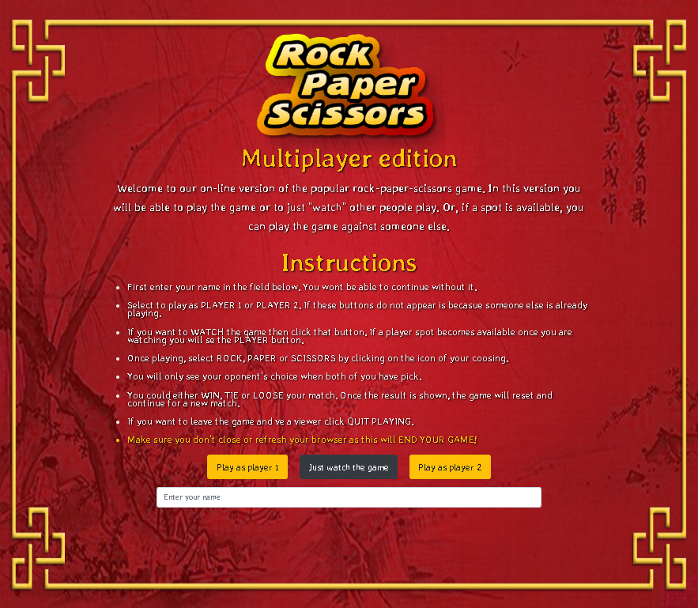
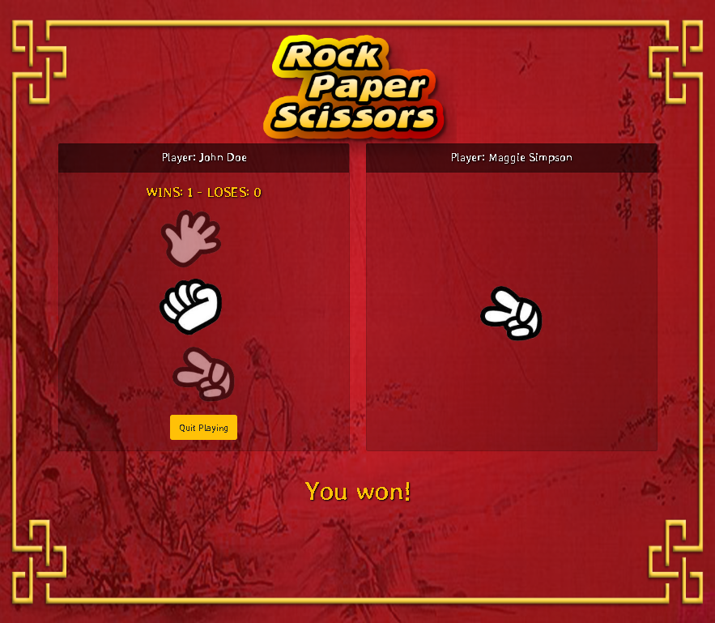
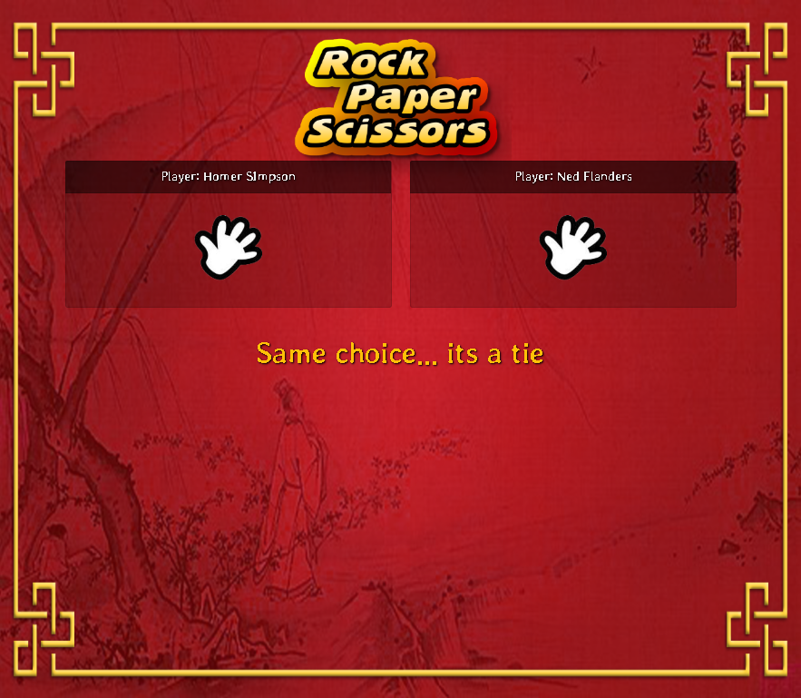

# Rock Paper Scissors - Multiplayer
> **Cretaed by:**     Juan I Diaz (jdi@idiaz.ca)

> **Date:**           January 2019

## DESCRIPTION
On-line version of the popular rock-paper-scissors game. In this version you will be able to just "watch" other people play or, if a spot is available, you can play the game against someone else.

## INSTRUCTIONS
1. First enter your name in the field below. You wont be able to continue without it.
2. Select to play as `PLAYER 1` or `PLAYER 2`. If these buttons do not appear is becasue someone else is already playing.
3. If you want to WATCH the game then click that button. If a player spot becomes available once you are watching you will se the PLAYER button.
4. Once playing, select `ROCK`, `PAPER` or `SCISSORS` by clicking on the icon of your coosing.
5. You will only see your oponent's choice when both of you have pick.
6. You could either `WIN`, `TIE` or `LOOSE` your match. Once the result is shown, the game will reset and continue for a new match.
7. If you want to leave the game and ve a viewer click `QUIT PLAYING`.
8. **Make sure you don't close or refresh your browser as this will END YOUR GAME!**

## SCREENSHOTS

## BUILDING TOOLS
- HTML, CSS
- Javascript and jQuery
- Bootstrap
- Google Firebase (Realtime)

## QUESTIONS OR COMMENTS
- Logo taken from [http://www.redbits.com/iphone/rps/](http://www.redbits.com/iphone/rps/).
- Feel free to contact the developer @ <jdi@idiaz.ca> or www.idiaz.ca !
- See the project [live](https://juanidiaz.github.io/RPS-Multiplayer/).